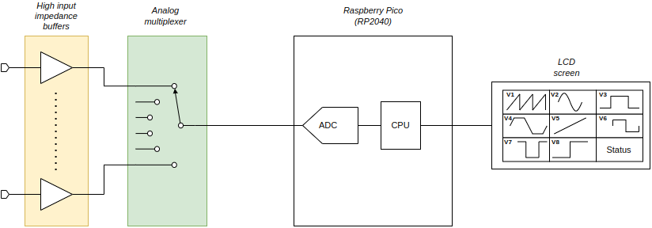

# Presentation



EyeVolt 2.0 is a **12-channel DC voltage monitor** **and** an **8-channel
programmable DC voltage generator**, both built around a single Raspberry Pi
Pico (the RP2040 `U9`).

On the **monitor** side the Pico continuously samples up to twelve external
voltages and streams the raw ADC readings out over USB-serial, exactly like
v1.1. On the **generation** side the Pico produces eight independent 0 - 3.3 V
outputs by low-pass-filtering eight PWM channels and buffering them; a feedback
multiplexer lets the Pico read its own generated outputs back.

A Python **Terminal User Interface (TUI)** on the PC displays the live
monitored values, progress bars and sparkline trends. The PC software can
optionally expose the readings through an **MCP (Model Context Protocol)
server** so that AI assistants / automation can query the voltages
programmatically.

> **Software status (2.0):** the firmware and PC software currently committed
> in this repository are the **v1.1 code** — they implement the original
> voltage-monitoring protocol only and do **not** yet match the 2.0 hardware.
> See the [Software status](#software-status-20) section below for what works
> today and what is still to be done.

The board has two monitoring domains (unchanged ranges from v1.1):

| Group | Channels | Full-scale | Conditioning | Routed to |
|-------|----------|-----------|--------------|-----------|
| Low-voltage  | 0 - 7  (8 ch) | 0 - 3.3 V | unity-gain buffer only               | MUX0 -> MUX1 (CH4) -> ADC0 (GP26) |
| High-voltage | 8 - 11 (4 ch) | 0 - 6.6 V | buffer + 2:1 resistive divider (÷2)  | MUX1 (CH0-CH3) -> ADC0 (GP26)      |

Because the RP2040 ADC only accepts 0 - 3.3 V, the high-voltage channels are
divided by two on the board (so 6.6 V at the input => 3.3 V at the ADC); the PC
software then multiplies back by two to display the true input voltage.

---

# Hardware

## What changed from v1.1

The 2.0 board keeps the exact same 12-channel voltage-monitoring function and
ranges as v1.1, but the analog multiplexing hardware was reworked, and a full
voltage-generation stage was added:

| Area | v1.1 | v2.0 |
|------|------|------|
| Monitor MUX topology | two independent 74HCT4051, each feeding its own ADC pin (MUX0->GP26, MUX1->GP27) | the two 74HCT4051 are **cascaded** and only **one** ADC pin is used for monitoring (MUX0 -> MUX1 CH4 -> GP26) |
| Monitor select lines | MUX0: S0/S1/S2 = GP10/11/12, MUX1: S0/S1/S2 = GP21/20/19 | MUX0: S0/S1/S2 = **GP12/11/10**, MUX1: S0/S1/S2 = **GP19/20/21** (S0 and S2 swapped on both muxes; `~E` and S1 unchanged) |
| High-voltage input nets | `V55IN0..3` | `V50IN0..3` (same ÷2 divider, same 0 - 6.6 V range — name only) |
| Voltage generation | none | **8 PWM outputs (GP2-GP9)** -> 2nd-order RC low-pass filter -> unity-gain buffer -> J2 output header |
| Output readback | none | a 3rd 74HCT4051 (U12) multiplexes the 8 generated outputs back to **GP27 (ADC1)** |
| Front-panel headers | J2/J3 = TFT/touchscreen (unused) | J2 = **DAC output IDC 2x20** (8 analog outputs + 8 raw PWM taps + power); TFT headers removed |

The input connector **J1** (2x10 box header) is pin-compatible with v1.1.

## Architecture (block-level)

```
                                       Voltage MONITORING                                  Voltage GENERATION
 +-----------+   +-----------------------+                                                    +--------------------+
 |           |V33>+-->|U3/U8 buffer x8 |---VBUFF0..7--> |     | (CH0..7)       PWM GP2..GP9 -->| R(10k)-C(1uF)-R-C  |--> OPA316 buffer x8
 |  J1 input |    |   (0-3.3V domain)  |                 |     |                              |   2nd-order LPF    |     (U4-7,U13-16)
 | connector |    +-----------------------+               |     |                              +--------------------+          |
 | 2x10 box  |            |                              | U11 | (MUX0)                                              0R  | OUT_LINK
 | header    |V50>--+-->|U1 buffer x4|--+  +---+         | 8:1 | ----------+                                           |
 |           |    |   |(high-V in)  |  +->|/2 |->|U2|--> |     |           |   +--------------------+                     |
 |           |    |   +-------------+--+  +---+  (x4)    +-----+           |   | U12 74HCT4051      |                     |
 |           |    |        100k/100k divider               |CH4|----------->| DAC feedback mux   |<--- DAC_OUT0..7 <----+
 |           |    |                                         |     |           | (U12)              |
 +-----------+    |    +-->|U2 buffer x4|---VBUFF8..11--> | U10 | (MUX1)   +--------------------+
                  |    |   |(after div) |                  | 8:1 |                       | common
                  |    |   +------------+                  |     | (CH0..3=HV, CH4=MUX0, | -> GP27 / ADC1 (readback)
                  |    +----------------------------------->|     |  CH5..7=spare)
                                                       +----+-----+
                                                       | common -> GP26 / ADC0 (monitor)
                                                       +----------+
                                                           Raspberry Pi Pico (U9)
        USB-CDC serial  (9600 8N1)  ----> PC running eyevolt_mcp.py
```

In words (monitoring path):

1. The voltages to be measured arrive on connector **J1** (a 2x10 box header).
2. Every input is **buffered** by a rail-to-rail CMOS op-amp configured as a
   unity-gain voltage follower, giving the circuit a very high input impedance
   so it does not perturb the device under test.
   * Low-voltage inputs `V33IN0..3` -> `U3` (MCP6L04 quad); `V33IN4..7` -> `U8`
     (MCP6L04 quad).
   * High-voltage inputs `V50IN0..3` -> `U1` (MCP6L04 quad), then a **100 k /
     100 k divider** (÷2), then buffered again by `U2` (MCP6L04 quad) so the
     divider node is not loaded.
3. The 8 low-voltage buffered signals (`VBUFF0..7`) feed **MUX0** (`U11`, a
   74HCT4051 8:1 analog multiplexer).
4. The 4 high-voltage buffered signals (`VBUFF8..11`) feed channels CH0-CH3 of
   **MUX1** (`U10`, also a 74HCT4051). **MUX0's common output is routed into
   MUX1's CH4 input**, so MUX1 selects between the 4 HV channels and the whole
   MUX0 bank. CH5-CH7 of MUX1 are spare (currently unused).
5. **MUX1's common output goes to ADC0 (GP26)** — this is the only ADC pin used
   for monitoring. The Pico enables MUX1, selects CH4 to reach the MUX0 bank,
   then cycles MUX0 through its 8 channels; for HV channels it selects CH0-CH3
   directly.

Generation path:

1. The Pico generates eight independent PWM signals on **GP2..GP9**
   (`DAC_PWM0..7`).
2. Each PWM signal passes through a **2nd-order passive RC low-pass filter**
   (10 kΩ + 1 µF, then 10 kΩ + 1 µF; per-stage cutoff ≈ 16 Hz) which converts
   the duty cycle into a DC level (0 - 3.3 V proportional to duty cycle).
3. Each filtered DC level is buffered by a unity-gain **OPA316** rail-to-rail
   op-amp (`U4,U5,U6,U7,U13,U14,U15,U16`).
4. A 0 Ω **OUT_LINK** jumper (`R25-R28`, `R45-R48`) ties each buffer output to
   its `DAC_OUTn` net on connector **J2** (the link can be removed to isolate
   or re-route a channel).
5. A third 74HCT4051 (**`U12`**, the *DAC feedback mux*) multiplexes the 8
   `DAC_OUT` signals onto **ADC1 (GP27)** so the firmware can read back every
   generated voltage and verify / trim it.

## Bill of materials (main components)

| Ref | Part | Function |
|-----|------|----------|
| U9 | Raspberry Pi Pico | MCU + dual ADC + USB-serial |
| U11 | 74HCT4051 | 8:1 analog multiplexer for the 3.3 V channels (**MUX0**) |
| U10 | 74HCT4051 | 8:1 analog multiplexer: HV channels CH0-3 + cascaded MUX0 on CH4 + spare CH5-7 (**MUX1**) |
| U12 | 74HCT4051 | 8:1 analog multiplexer for the 8 generated-output readback (**DAC feedback mux**) |
| U3, U8 | MCP6L04 (quad op-amp) | unity-gain buffers for the 8 low-voltage channels |
| U1 | MCP6L04 (quad op-amp) | input buffers for the 4 high-voltage channels |
| U2 | MCP6L04 (quad op-amp) | post-divider buffers for the 4 high-voltage channels |
| U4, U5, U6, U7, U13, U14, U15, U16 | OPA316 (single op-amp, SOT-23-5) | unity-gain buffers for the 8 generated outputs |
| R9-R12 | 100 kΩ | top leg of the 2:1 divider (one per HV channel) |
| R13-R16 | 100 kΩ | bottom leg of the divider to GND (one per HV channel) |
| R1-R8, R17-R24, R29-R44 | 10 kΩ | first and second series resistors of the 8 PWM low-pass filters |
| C3-C18, C27-C42 | 1 µF | filter capacitors of the 8 PWM low-pass filters (each with a DNP thru-hole alternate) |
| R25-R28, R45-R48 | 0 Ω (OUT_LINK) | jumpers linking each output buffer to its `DAC_OUT` net |
| C1-C2, C19-C26, C43-C47 | decoupling | local bypassing for the op-amps and the muxes |
| J1 | Conn_02x10 (2.54 mm box header) | voltage-monitor inputs + GND |
| J2 | IDC 2x20 (2.54 mm) | generation outputs: 8 analog `DAC_OUT`, 8 raw `DAC_PWM` taps, 5 V / 3.3 V / GND |
| H1-H4 | Mounting holes | mechanical |

The monitoring op-amps are Microchip **MCP6L04** (quad, 1 MHz, 85 µA,
rail-to-rail I/O) and the output buffers are TI **OPA316** (single, 2 MHz,
rail-to-rail I/O) — both low-cost, low-bias, supplied from the Pico's 3.3 V
rail. The pin-compatible MCP6024 and OPA4316 are kept as alternatives in
`doc/datasheets/opamp/`.

## Input connector J1 pinout (voltage monitor)

J1 is a 2x10 (2.54 mm) box header. The odd-numbered row carries the eight
low-voltage inputs (`V33IN0..7`); the even-numbered row carries the four
high-voltage inputs (`V50IN0..3`) plus ground. Pinout is compatible with v1.1.

> Pinout below is taken from the generated netlist (`hw/pcb/eyevolt.net`).
> Verify against the current schematic if in doubt.

| J1 pin | Signal   | Range      | EyeVolt channel |
|--------|----------|------------|-----------------|
| 1      | V33IN0   | 0 - 3.3 V  | ch 0  (MUX0 CH0) |
| 3      | V33IN1   | 0 - 3.3 V  | ch 1  (MUX0 CH1) |
| 5      | V33IN2   | 0 - 3.3 V  | ch 2  (MUX0 CH2) |
| 7      | V33IN3   | 0 - 3.3 V  | ch 3  (MUX0 CH3) |
| 9      | V33IN4   | 0 - 3.3 V  | ch 4  (MUX0 CH4) |
| 11     | V33IN5   | 0 - 3.3 V  | ch 5  (MUX0 CH5) |
| 13     | V33IN6   | 0 - 3.3 V  | ch 6  (MUX0 CH6) |
| 15     | V33IN7   | 0 - 3.3 V  | ch 7  (MUX0 CH7) |
| 2      | V50IN0   | 0 - 6.6 V  | ch 8  (MUX1 CH0) |
| 4      | V50IN1   | 0 - 6.6 V  | ch 9  (MUX1 CH1) |
| 6      | V50IN2   | 0 - 6.6 V  | ch 10 (MUX1 CH2) |
| 8      | V50IN3   | 0 - 6.6 V  | ch 11 (MUX1 CH3) |
| 10,12,14,16 | NC  | —          | not connected   |
| 17,18,19,20 | GND | —          | signal / return ground |

## Output connector J2 pinout (voltage generation)

J2 is a 2x20 (2.54 mm) IDC header. Each signal is bussed across a pair of pins
(standard IDC ribbon style). It exposes the 8 **buffered analog outputs**
(`DAC_OUT0..7`), the 8 **raw PWM taps** (`DAC_PWM0..7`, also driven by the
Pico), and the 5 V / 3.3 V / GND power rails.

| J2 pins      | Signal     | Direction | Notes |
|--------------|------------|-----------|-------|
| 1, 2, 3, 4   | GND        | —         | signal / return ground |
| 5, 6         | VDD50      | power out | 5 V (VBUS) rail |
| 7, 8         | VDD33      | power out | 3.3 V rail |
| 9, 10        | DAC_OUT7   | analog out| buffered generated output 7 |
| 11, 12       | DAC_OUT6   | analog out| buffered generated output 6 |
| 13, 14       | DAC_OUT5   | analog out| buffered generated output 5 |
| 15, 16       | DAC_OUT4   | analog out| buffered generated output 4 |
| 17, 18       | DAC_OUT3   | analog out| buffered generated output 3 |
| 19, 20       | DAC_OUT2   | analog out| buffered generated output 2 |
| 21, 22       | DAC_OUT1   | analog out| buffered generated output 1 |
| 23, 24       | DAC_OUT0   | analog out| buffered generated output 0 |
| 25, 26       | DAC_PWM7   | digital   | raw PWM tap 7 (driven by GP9) |
| 27, 28       | DAC_PWM6   | digital   | raw PWM tap 6 (driven by GP8) |
| 29, 30       | DAC_PWM5   | digital   | raw PWM tap 5 (driven by GP7) |
| 31, 32       | DAC_PWM4   | digital   | raw PWM tap 4 (driven by GP6) |
| 33, 34       | DAC_PWM3   | digital   | raw PWM tap 3 (driven by GP5) |
| 35, 36       | DAC_PWM2   | digital   | raw PWM tap 2 (driven by GP4) |
| 37, 38       | DAC_PWM1   | digital   | raw PWM tap 1 (driven by GP3) |
| 39, 40       | DAC_PWM0   | digital   | raw PWM tap 0 (driven by GP2) |

## Analog conditioning detail

* **Low-voltage channels (0-7):** each input drives the `+` input of an op-amp
  voltage follower whose output is shorted to its `-` input. The output
  (`VBUFF0..7`) goes directly to one of MUX0's analog inputs. No scaling — the
  displayed voltage equals the measured voltage (up to the 3.3 V rail).

* **High-voltage channels (8-11):** each input is first buffered (U1, high
  impedance), then split by a 100 k / 100 k divider to GND, then buffered again
  (U2) before reaching MUX1. The two-stage buffering keeps the divider node
  high-impedance and accurate. The ADC therefore sees `Vin / 2`, and the PC
  software restores the real value by multiplying by 2 (`raw / 65536 * 6.6`).

## Multiplexing (74HCT4051)

Each 74HCT4051 selects one of 8 analog inputs onto a common pin `A` according to
the 3-bit address `S2 S1 S0`, while `~E` (active-low enable) gates the output.
When `~E = 1` the switch is high-impedance. The Pico drives these logic pins
directly. On the board, VEE is tied to GND (single-supply operation, 0 - VCC
analog range) and VCC is the 3.3 V rail.

**Monitor cascade:** in 2.0, MUX0's common is wired to **MUX1 channel 4**, so
the firmware must (a) enable MUX1 and address CH4 to "see through" to the
8 low-voltage channels, then (b) cycle MUX0; the high-voltage channels are read
by addressing MUX1 CH0-CH3 directly. All twelve channels exit on **GP26**.

**Feedback mux:** `U12` independently switches the 8 generated `DAC_OUT`
signals onto **GP27** so each output voltage can be measured back by the Pico.

## PWM generation chain

Each of the 8 output channels is identical:

```
GPn (PWM) -- R 10k -- (C 1uF to GND) -- R 10k -- (C 1uF to GND) -- OPA316 unity buffer -- 0R OUT_LINK -- DAC_OUTn -> J2
```

This is a 2nd-order passive RC low-pass filter (per-stage cutoff
`1/(2*pi*10k*1uF) ≈ 16 Hz`) followed by a rail-to-rail unity-gain buffer. The
steady-state output is `duty * 3.3 V` over the 0 - 3.3 V range. The filter
strongly attenuates the PWM carrier so the output is essentially DC; the buffer
provides a low-impedance output to the load via J2.

## Power

The board is powered by the Pico's USB connection. The 3.3 V rail (`VDD33`)
powers the op-amps and the multiplexers and serves as the ADC reference. A 5 V
rail (`VDD50` = VBUS) is also present and is exposed on the J2 output header.

---

# Firmware (Pico, MicroPython)

Location: `sw/pico/micropython/main.py`. It is plain MicroPython using the
`machine` module; `boot.py` is empty (USB-CDC is configured in the firmware
image, not at run time).

## Pico pin mapping (2.0 hardware)

| GPIO | Direction | Net (schematic) | Purpose |
|------|-----------|-----------------|---------|
| GP2  | out (PWM) | DAC_PWM0 | generation PWM, output 0 |
| GP3  | out (PWM) | DAC_PWM1 | generation PWM, output 1 |
| GP4  | out (PWM) | DAC_PWM2 | generation PWM, output 2 |
| GP5  | out (PWM) | DAC_PWM3 | generation PWM, output 3 |
| GP6  | out (PWM) | DAC_PWM4 | generation PWM, output 4 |
| GP7  | out (PWM) | DAC_PWM5 | generation PWM, output 5 |
| GP8  | out (PWM) | DAC_PWM6 | generation PWM, output 6 |
| GP9  | out (PWM) | DAC_PWM7 | generation PWM, output 7 |
| GP10 | out | MUX0_S2 | MUX0 address bit 2 |
| GP11 | out | MUX0_S1 | MUX0 address bit 1 |
| GP12 | out | MUX0_S0 | MUX0 address bit 0 |
| GP13 | out | MUX0_EB | MUX0 enable (`~E`, active low) |
| GP14 | out | DACMUX_S1 | DAC feedback mux address bit 1 |
| GP15 | out | DACMUX_S0 | DAC feedback mux address bit 0 |
| GP16 | out | DACMUX_S2 | DAC feedback mux address bit 2 |
| GP17 | out | DACMUX_EB | DAC feedback mux enable (`~E`, active low) |
| GP18 | out | MUX1_EB | MUX1 enable (`~E`, active low) |
| GP19 | out | MUX1_S0 | MUX1 address bit 0 |
| GP20 | out | MUX1_S1 | MUX1 address bit 1 |
| GP21 | out | MUX1_S2 | MUX1 address bit 2 |
| GP26 | in (ADC0) | MON_ADC_A | MUX1 common -> reads all 12 monitor channels (LV via cascade) |
| GP27 | in (ADC1) | DAC_FB_A | DAC feedback mux common -> reads back the 8 generated outputs |

## Principle of operation (v1.1-compatible monitoring)

> The firmware currently checked in (`main.py`) is the **v1.1** firmware: it
> drives MUX0 / MUX1 as two independent muxes and reads **two** ADC pins
> (GP26 + GP27). On the **2.0** hardware this is incorrect — MUX1's select
> lines are remapped and all 12 channels now arrive on **GP26 only** (GP27 is
> the DAC-feedback ADC). See [Software status](#software-status-20).

The intended v1.1-compatible scan (to be re-implemented for 2.0) repeatedly:

1. Selects **MUX1 CH4** (the cascade), then scans **MUX0** channels 0..7: for
   each channel it writes the 3-bit MUX0 address, asserts `~E`, waits for the
   switch and buffer to settle, then reads **ADC0 (GP26)**.
2. Scans **MUX1** channels 0..3 (the HV channels) directly, reading ADC0.
3. Prints two text lines (one per group) over USB-serial.

`read_u16()` returns a 16-bit value (0..65535) proportional to the voltage at
the ADC pin relative to the 3.3 V reference. The firmware sends the *raw* value
unchanged; all scaling is done on the PC side.

## Serial protocol

USB-CDC, **9600 baud, 8N1**, ASCII text. The Pico emits two lines per cycle:

```
1::VVVVV VVVVV VVVVV VVVVV VVVVV VVVVV VVVVV VVVVV
2::VVVVV VVVVV VVVVV VVVVV
```

* `1::` introduces the 8 low-voltage channels (0..7), space-separated,
  zero-padded to 5 digits.
* `2::` introduces the 4 high-voltage channels (8..11), space-separated.
* Values are raw 16-bit ADC codes (0..65535).

There is no request/response framing and no checksum: the device streams
continuously and the host synchronises on the `1::` / `2::` headers. The 2.0
firmware will keep this protocol so the PC software and the MCP tools remain
backward-compatible.

---

# PC software

The recommended version is `sw/pc/eyevolt_mcp.py` (a richer superset of the
older `sw/pc/eyevolt_pc.py`). It is a single-file Python application built with
**Textual** (TUI), **pyserial-asyncio** (serial), and an optional **MCP over
SSE** server (Starlette + Uvicorn).

## Serial acquisition & scaling

`SerialProtocol` buffers bytes until a newline, then `process_line()` decodes
each frame:

* `1::` frame -> 8 integers, converted with `raw / 65536 * 3.3`  (volts, 0-3.3 V)
* `2::` frame -> 4 integers, converted with `raw / 65536 * 6.6`  (volts, 0-6.6 V)

The resulting 12 float values are pushed into the 12 display widgets.

## Terminal User Interface (TUI)

`SerialTUI` lays out **12 `VoltageDisplay` widgets in a 3x4 grid**. Each widget
contains a label with the channel name and current value, a progress bar
showing the value as a percentage of the channel full-scale (3.3 V for
channels 0-7, 6.6 V for channels 8-11), and a sparkline of recent history
(rolling window, default 128 samples). A colour scheme highlights abnormal
rails:

| Voltage | Colour |
|---------|--------|
| < 0.5 V     | white  |
| 0.5 - 0.8 V | yellow |
| 0.8 - 1.2 V | green  |
| >= 1.2 V    | red    |

## MCP server

When started with `--mcp`, an `EyeVoltMCPServer` runs an MCP server over
Server-Sent Events (SSE) on `127.0.0.1:8088` by default, in a background
thread. It exposes the live readings as tools that an MCP-compatible client
(e.g. an AI coding assistant) can call:

| Tool | Description |
|------|-------------|
| `get_voltages`        | All enabled channels as `{name: voltage}` |
| `get_voltage`         | One channel by name |
| `get_voltage_idx`     | One channel by index (0-11) |
| `get_channel_info`    | Full per-channel info (name, enabled, voltage, max) |
| `get_channel_history` | Sparkline history (percentages 0-100) for a named channel |

## Command-line usage

```
eyevolt_mcp.py [-h] [--text VAL=NAME,...] [--channel VAL=on|off,...]
               [--history N] [--mcp] [--mcp-host H] [--mcp-port P] [-v]
               PORT
```

* `PORT` — serial device, e.g. `/dev/ttyACM0` (Linux/macOS) or `COM3` (Windows).
* `--text` — rename channels, zero-based, e.g. `val0=VCORE,val1=VIO`.
* `--channel` — enable/disable channels, e.g. `val8=off,val9=off`. Channels not
  listed default to **on**; disabled channels show `----`.
* `--history` — sparkline length (default 128).
* `--mcp` — start the MCP/SSE server.
* `--mcp-host` / `--mcp-port` — MCP bind address (default `127.0.0.1:8088`).
* `-v` / `-vv` — info / debug logging.

Examples (see `sw/pc/readme.txt`):

```
./eyevolt_mcp.py --text val0=VCORE,val1=VIO /dev/ttyACM0

./eyevolt_mcp.py \
    --text val0=VCORE,val1=VMAX,val2=VMAIN,val3=VULP,val4=VPERIPH,\
val5=VCOREDIG,val6=VCORERAD,val7=VIO \
    --channel val8=off,val9=off,val10=off,val11=off \
    /dev/ttyACM0

./eyevolt_mcp.py --mcp /dev/ttyACM0        # also expose readings to MCP clients
```

---

# Software status (2.0)

The hardware described above is the **2.0** design, but the software in this
repository is still the **v1.1** implementation. Concretely:

| Feature | Status |
|---------|--------|
| 12-channel voltage monitoring (serial protocol `1::`/`2::`) | **Planned.** The protocol and PC side stay the same; only the Pico scan routine changes for the 2.0 MUX cascade / remapped select lines. The intent is for the device to expose the **same** v1.1 monitoring protocol by default. |
| Current `main.py` on 2.0 hardware | **Does not work as-is.** It uses two ADC pins and the v1.1 select-line mapping; on 2.0 all 12 channels arrive on GP26 and GP27 is the DAC-feedback ADC. |
| 8-channel voltage generation (PWM + filter + buffer) | **Not implemented.** Requires new firmware (PWM setup on GP2-GP9, duty-cycle commands) and PC/MCP tooling to set voltages. |
| Output readback via U12 / GP27 | **Not implemented.** Needs firmware + PC support to read and report generated voltages. |
| PC TUI / MCP server | **Working**, unchanged from v1.1 (monitoring only). |

### What the 2.0 firmware update needs (monitoring)

* Drive MUX0 select lines on the **new** GPIOs (S0=GP12, S1=GP11, S2=GP10).
* Drive MUX1 select lines on the **new** GPIOs (S0=GP19, S1=GP20, S2=GP21).
* To read the 8 low-voltage channels: enable MUX1, select **CH4** (cascade),
  then cycle MUX0 0..7 and read **ADC0 (GP26)**.
* To read the 4 high-voltage channels: select MUX1 **CH0..CH3** and read ADC0.
* Keep emitting the `1::` (8 values) / `2::` (4 values) lines so the PC
  software and MCP tools are unchanged.

### What the 2.0 generation feature needs

* PWM setup on GP2-GP9 with a carrier frequency well above the 16 Hz filter
  cutoff.
* A serial command set to set per-channel duty cycle (target voltage).
* Readback of the 8 `DAC_OUT` signals through U12 on **GP27 (ADC1)**.
* PC / MCP tooling to set and monitor the 8 generated voltages.

---

# Running the system end-to-end

1. **Flash the Pico** with a MicroPython image (USB-CDC enabled), then copy
   `sw/pico/micropython/main.py` onto it (the `sw/pico/micropython/Makefile`
   provides `make copy` via `rshell` and `make run` via `mpremote`). On power-up
   the Pico starts streaming `1::`/`2::` lines at 9600 baud.
2. **Set up the PC environment** (`requirements.txt`):
   `pip install -r requirements.txt` (textual, pyserial-asyncio, mcp, starlette,
   uvicorn, rich, ...).
3. **Run the TUI**, pointing it at the Pico's serial port and labelling the
   channels to match your DUT (example above).
4. **(Optional)** add `--mcp` and connect an MCP client to `http://127.0.0.1:8088/sse`.

> Note: step 1 assumes the firmware already matches the 2.0 monitoring routing.
> Until that update is done, the device will not produce correct readings on
> 2.0 hardware (see [Software status](#software-status-20)).

---

# End-to-end data path (summary)

```
MONITORING:
DUT rail -- J1 -- op-amp buffer (+÷2 divider on HV channels)
        -- 74HCT4051 MUX0 -> MUX1 CH4 / MUX1 CH0..3 (U11 -> U10, selected by GP10..13, GP19..21, GP18)
        -- Pico ADC0 (GP26)
        -- MicroPython reads raw 16-bit codes, prints "1::.." / "2::.."
        -- USB-CDC @9600 baud
        -- eyevolt_mcp.py (async serial reader)
        -- Textual TUI (value + bar + sparkline) and/or MCP/SSE server

GENERATION (not yet implemented):
PC target voltage -> serial command -> Pico sets PWM duty on GP2..GP9
        -> 2nd-order RC LPF (10k/1uF, ~16 Hz) -> OPA316 unity buffer
        -> 0R OUT_LINK -> DAC_OUT0..7 -> J2
        -> (readback) U12 74HCT4051 feedback mux -> Pico ADC1 (GP27)
```
